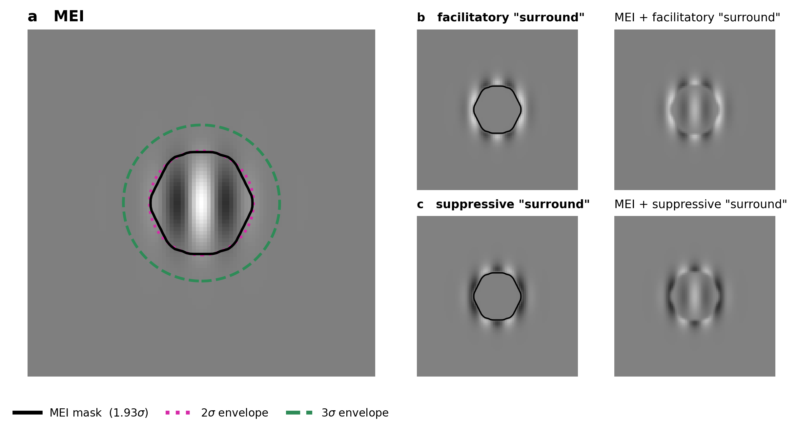

# Surround facilitation as an artifact of the MEI-and-mask procedure

Code behind a Letter and its Supplement addressing Fu et al. (2026, *Neuron* 114(13):2473–2486).
**The letter DOI will be added here when published.**

It demonstrates that the surround facilitation effects reported in Fu et al. can be explained as
an artifact of their procedure. **Apparent surround facilitation arises
in models that lack any surround mechanism.** This is because the procedure
finds a mask that is smaller than the model's center mechanism (a linear filter).
Optimization of the nominal surround stimulus exploits this to further activate
the center mechanism. We demonstrate the artifact in different models.
We also show the procedure can find genuine surround facilitation in a model that has
a facilitatory surround mechanism.

This is a **proof of principle**, not an exhaustive study of MEIs and surrounds.

---

## The result in one figure



The MEI mask covers close to 2σ of the filter's envelope.
The filter's fringes up to 3σ are outside the mask, thus a nominal "surround" stimulus drives the filter:

| | Model A | Model B | Model C |
|---|---|---|---|
| | *no surround mechanism* | *divisive normalization* | *genuine facilitatory surround* |
| facilitation, with mask undilated | **+27%** | +13% | +49% |
| suppression, with mask undilated | **−27%** | −64% | −58% |
| facilitation once the mask reaches 3σ | **+1%** | +1% | **+31%** |

**Model A has no surround mechanism and still produces ±27%.**
If we dilate the mask until it covers the filter, facilitation drops to 1% in models A,B where it is an artifact.
Model C, which has a real facilitatory mechanism, keeps 31%.

## The three models

| | what it is | why it is here |
|---|---|---|
| **A** | LN Gabor. One linear filter, ELU+1 output. | The negative control. No pool, no inhibition, **no surround mechanism of any kind**. Facilitation is produced entirely by the center/surround definition. |
| **B** | Heeger divisive normalization over a 10,000-unit pool. d₀ = 2 primary; d₀ = 0 is the faithful replication of their published model. | One of the models used in Fu et al. It includes a suppressive surround but no facilitatory surround. |
| **C** | Model B's pool plus a multiplicative gain from an orthogonally tuned annular pool. | This model adds a facilitatory surround mechanism. |

## Layout

```
csartifact/          the numerics: models, mask, optimize, measure, config
scripts/             sweeps, figure scripts, run_all.py, emit_numbers.py, the widget builder
results/             the computed results (committed) + stimuli.npz + numbers.json
figures/             the figures as PDF, Supplementary Figure 2 also as PNG
docs/                an interactive demonstration of the mask-radius effect
third_party/         featurevis, vendored (MIT, with its own LICENSE)
LICENSE  NOTICE      MIT, and the one third-party modification
DEVIATIONS.md        deviations from their method, and implementation notes
NUMBERS.md           every printed number, with the conventions it was measured under
```

## Reproducing

**Setup.** Python 3.11 or later. From the repository root,
`python3 -m pip install .` installs the pinned dependencies listed in `pyproject.toml`.

**To look at the results**, read `results/*.json` and redraw every figure in seconds:

```
python3 scripts/run_all.py --only figures
```

**To verify them**, regenerate everything from scratch — a little over an hour on a
MacBook Pro, most of it the dilation sweep, which re-optimizes the surround at every
mask size:

```
python3 scripts/run_all.py
```

**The interactive widget** in `docs/` is not part of `run_all.py`; it takes seconds to
rebuild:
```
python3 scripts/sweep_dilation_dense.py
python3 scripts/make_widget.py
```

## About `NUMBERS.md`

Every number in the manuscripts has a key there, with the conventions it was
measured under: which mask (`binary` or `soft`) and which MEI (`ideal` or
`numerical`). Several quantities are printed under more than one, and the values
differ.

All of them are outputs of the code here: `python3 scripts/run_all.py` regenerates
every one.

## Where each figure in the Supplement comes from

| Supplement | figure file | drawn by | data, and the script that computes it |
|---|---|---|---|
| Figure 1 | panel (a) of `figures/SuppFig2_model_A.pdf` | `scripts/suppfig2_model_a.py` | `results/stimuli.npz` ← `scripts/make_stimuli.py` |
| Figure 2 | `figures/Fig2_dilation.pdf` | `scripts/fig2_dilation.py` | `results/*_dilation.json` ← `scripts/sweep_dilation.py` |
| Figure 3 | `figures/Fig3_annulus.pdf` | `scripts/fig3_annulus.py` | `results/*_annulus.json` ← `scripts/sweep_annulus.py` |
| Figure 4 | `figures/Fig4_stimuli.pdf` | `scripts/fig4_stimuli.py` | `results/stimuli.npz` ← `scripts/make_stimuli.py` |
| Supplementary Figure 1 | a schematic with an inset of macaque V1 size-tuning data; not generated by this repository | — | — |
| Supplementary Figure 2 | `figures/SuppFig2_model_A.pdf` and `.png` | `scripts/suppfig2_model_a.py` | `results/stimuli.npz` ← `scripts/make_stimuli.py` |

Every number quoted in the text is listed in `NUMBERS.md`, computed by
`scripts/emit_numbers.py`. 

## Third-party code and licensing

**This repository is MIT licensed** — see `LICENSE`, © 2026 Ruben Coen-Cagli.

`third_party/featurevis` is [cajal/featurevis](https://github.com/cajal/featurevis),
MIT, © 2019 Cajal MICrONS Team, vendored with its own LICENSE retained unmodified in
that directory. It is modified in one place: `scipy.signal.gaussian` →
`scipy.signal.windows.gaussian`, which exists on both sides of the SciPy 1.13
removal, so no version pin is needed for compatibility (`pyproject.toml` pins SciPy
for reproducibility only). `NOTICE` records that.

Three of the repositories deposited with the original paper carry no license, and
nothing here is copied from any of them. The mask construction is an independent
implementation of an algorithm the paper describes; `ChangeSurroundStd` is an
independent reimplementation of an operation absent from public featurevis. The
provenance was audited against the repositories live on 2026-09-21 and is recorded in
full in `DEVIATIONS.md` D3.

The paper is not redistributed here; follow the DOI.
